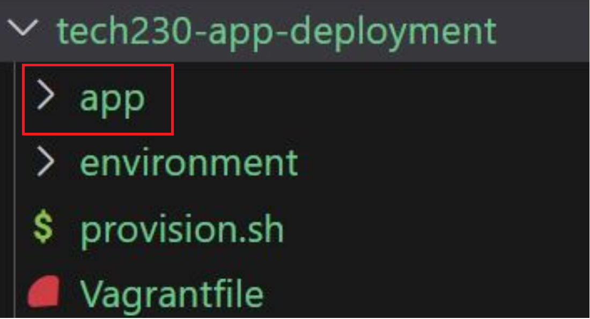
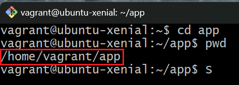
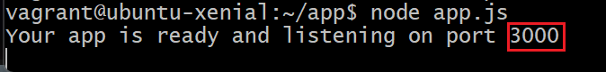
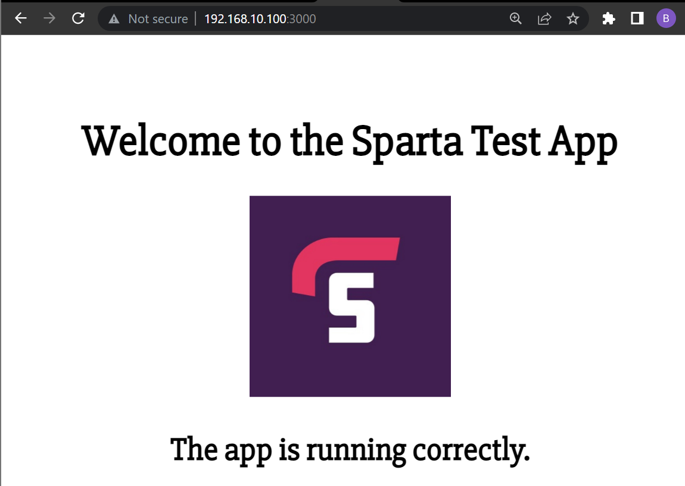

# App Deployment

This guide will explain how to deploy a web app on an Nginx web server hosted on our Vagrant VM.

Pre-requisites:

- Understand how to create and run an Nginx web server using Vagrant: [tech230-vagrant-intro](https://github.com/bradley-woods/tech230-vagrant-intro)
- Have your application to be deployed in a folder called 'app' in the same directory as your 'Vagrantfile':

    

## Updating the Vagrantfile

1. Following on from the previous repository, which explained how to create a VM and deploy an Nginx web server on it, we need to first update the 'Vagrantfile' by adding a new line `config.vm.synced_folder "app", "/home/vagrant/app"` shown below:

    ```ruby
    Vagrant.configure("2") do |config|
    
      # configure the VM settings
      config.vm.box = "ubuntu/xenial64"
      config.vm.network "private_network", ip:"192.168.10.100"

      # provision the VM to have nginx web server
      config.vm.provision "shell", path: "provision.sh"

      # move app folder from local machine to the VM
      config.vm.synced_folder "app", "/home/vagrant/app"

    end
    ```

    > **Note:** the first argument "app" is to specify the app folder that will be synced with the "/home/vagrant/app" directory in the VM, where "/" at the start of the filepath indicates user and not root directory.

2. Let's start up our VM using the following command ensuring we are in the correct directory:

    ```console
    $ vagrant up
    ```

## Installing App Dependencies

1. At this point, we should have a provisioned VM running an Nginx web server containing our syncronised app folder. To check this, `vagrant ssh` into the VM on a Git bash terminal and enter `cd app` followed by `pwd` to print the working directory. The following should appear if the VM was installed and syncronised correctly.

    

2. The next step is to install a list of app dependencies (packages that our app need to work properly) using the following commands. In summary, this installs the required software and tools necessary to run the app on the VM, such as nodeJS, process manager and Python software properties.

    ```console
    $ sudo apt-get install nodejs -y

    $ sudo apt-get install python-software-properties

    $ curl -sL https://deb.nodesource.com/setup_6.x | sudo -E bash -

    $ sudo apt-get install nodejs -y

    $ sudo npm install pm2 -g
    ```

    > **Note:** The curl command retrieves and downloads a package from the provided url. Also, the second `install nodejs` command is to get the correct version from the curl command.

3. Now, navigate to the app folder if you wasn't already inside it, using `cd app` and run the following command to install any necessary node modules the developers say we need to run the app:

    ```
    app$ npm install
    ```

    > **Note:** `app$` indicates you are in the correct 'app' folder.

## Running the App

1. The final step is simple, we just need to run the following command to start our app, which displays the following information in terminal to tell us which port the app is running:

    ```
    app$ node app.js
    ```

    

2. Now, if we go to our browser address bar and type the IP address followed by the port number (192.168.10.100:3000) we are presented with our web app successfully deployed on our VM!

    

## Automating the App Deployment

1. We will now automate the previous steps simply by adding to our shell script file 'provisions.sh'. We want to ensure all of the necessary app dependencies are installed, followed by changing directory to the 'app' folder and then installing the node package manager (npm) and running our app with the command `node app.js`. The 'provision.sh' script should look similar to the below:

    ```bash
    #!/bin/bash

    sudo apt-get update -y
    sudo apt-get upgrade -y

    # Install nginx web server
    sudo apt-get install nginx -y

    # Start nginx web server 
    sudo systemctl start nginx

    # Display nginx web server status to check it is running
    sudo systemctl status nginx

    # Install app dependencies
    sudo apt-get install python-software-properties
    curl -sL https://deb.nodesource.com/setup_6.x | sudo -E bash -
    sudo apt-get install nodejs -y
    sudo npm install pm2 -g

    # Install npm in app directory and run the app
    cd app
    npm install
    node app.js
    ```

2. Proceed by running the `vagrant up` command. Wait until everything installs (this may take some time). Once everything is finished, the final line in the terminal should display `Your app is ready and listening on port 3000` as previously shown in the manual method.

3. The server should now be running with the app listening on port 3000, go ahead and type in the IP and port number (192.168.10.100:3000) into the browser address bar and you should see your app running!
